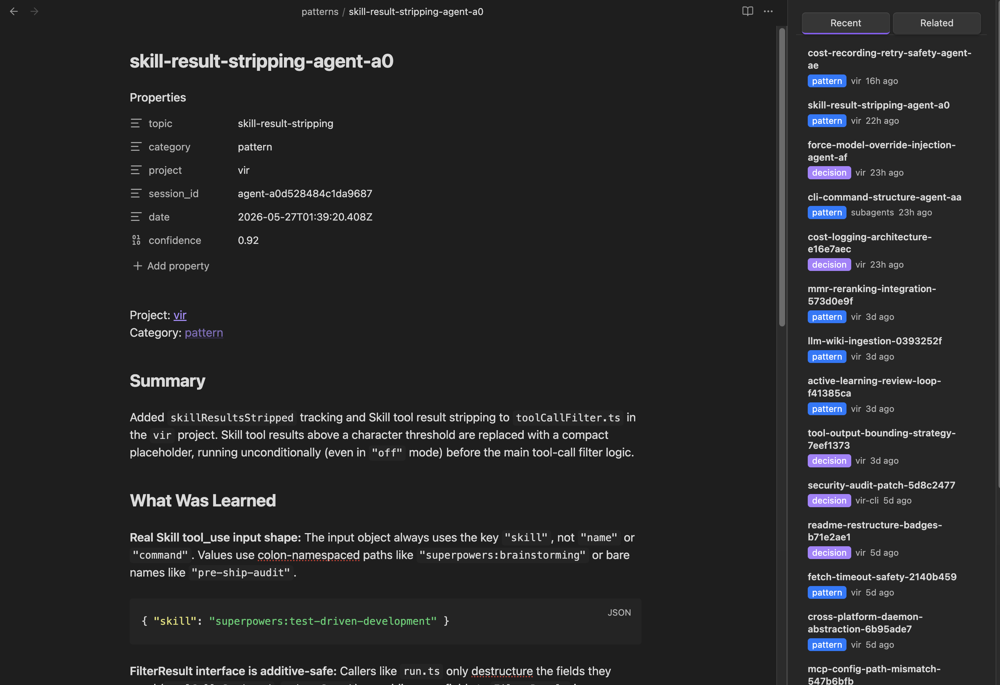

# Vir for Obsidian

**An LLM Wiki for Claude Code, in your Obsidian sidebar.** Surface relevant notes from your distilled session knowledge as you work.

> [`vir`](https://www.npmjs.com/package/@djolex999/vir-cli) distills your Claude Code sessions into an Obsidian vault of patterns, gotchas, decisions, and tools. This plugin brings that knowledge into Obsidian's sidebar — so the right note finds you while you're writing, not three searches later.



## What it does

- **Status bar** — a live health dot for the vir daemon (healthy / stale / down / CLI-not-found). Click it to open settings.
- **Sidebar pane** — a **Recent** tab that scans your vault for vir-distilled notes, and a **Related** tab that queries `vir` for notes relevant to the note you're editing.
- **Commands** — `Vir: Search vault`, `Vir: Surface related notes`, and `Vir: Open settings` from the command palette.

## Install

**From the Community Plugins marketplace** *(pending review)*: search for "Vir" in Settings → Community plugins → Browse. _(Link added once approved.)_

**Manual install:**

1. Download `main.js`, `manifest.json`, and `styles.css` from the [latest release](https://github.com/djolex999/vir-obsidian/releases).
2. Copy them into `<your-vault>/.obsidian/plugins/vir/`.
3. Reload Obsidian, then enable **Vir** under Settings → Community plugins.

## Setup

This plugin is a thin client over the `vir` CLI — install and configure it first:

```bash
npm install -g @djolex999/vir-cli
vir init          # interactive setup: points vir at your vault, configures the daemon
```

Then, in the plugin's settings:

1. Click **Detect** to resolve the `vir` binary path. (Detect runs through your login shell, so it finds binaries installed via **nvm**/**asdf** — Obsidian's own process PATH usually doesn't include those, which is why a bare `vir` may not work.)
2. Click **Test connection** to confirm the plugin can reach `vir doctor`.
3. Adjust poll interval, recent/related counts, and the minimum confidence threshold to taste.

> **Desktop only.** `vir` is a CLI tool bound to a background daemon, so the plugin doesn't run on mobile.

## The three surfaces

### Status bar
A colored dot reflects daemon health, polled on an interval (default 30s):

- 🟢 **healthy** — daemon running
- 🟡 **stale** — daemon up, last poll was a while ago (tooltip shows when)
- 🔴 **down / unreachable** — daemon not running
- ⚪ **unknown** — the `vir` CLI couldn't be found (set the path in settings)

### Recent tab
Scans the vault directly (no `vir` call) for notes carrying vir's frontmatter `category` (`pattern` · `gotcha` · `decision` · `tool` · `article`), newest first, with a color-coded badge, project, and relative date. Click to open.

### Related tab
Runs `vir query` against the note you're editing (debounced) and lists the most relevant distilled notes. Results preserve `vir`'s own ranking (it diversifies via MMR — the plugin never re-sorts), filtered by a confidence threshold you control.

## Links

- **vir CLI** — [`@djolex999/vir-cli` on npm](https://www.npmjs.com/package/@djolex999/vir-cli)
- **The Compounding Codebase** — the manifesto behind vir _(coming soon at djordje.dev)_

## License

[MIT](LICENSE) © Djordje Marković
